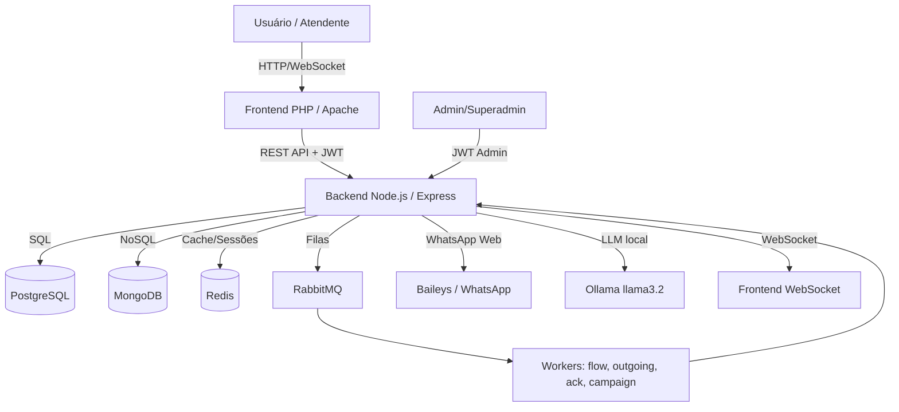

# ARQUITETURA.md — Arquitetura do Sistema

**Projeto:** SaaS Chatbot / Chatbot_Mauricio  
**Atualizado em:** 2026-07-02  
**Status:** MVP / Refatoração (backend ativo em Node.js, frontend PHP, legados .NET e Python preservados)

---

## 1. Visão Geral

O **SaaS Chatbot** é uma plataforma omnichannel de chatbots e atendimento humano, com foco principal na integração com WhatsApp. O sistema é multi-tenant, permite hierarquia de revendas (white-label), automação de fluxos de conversação, atendimento humano em tempo real, faturamento por planos e integração com IA local via Ollama.

Público-alvo:
- Administradores da plataforma (superadmin).
- Revendas que gerenciam seus próprios clientes (white-label).
- Clientes finais que operam chatbots e atendimento.
- Atendentes humanos que respondem conversas em tempo real.

Problema resolvido: centralizar atendimento via WhatsApp em uma única plataforma SaaS, com automação, filas humanas, histórico persistente, controle de planos e marca própria para revendas.

---

## 2. Stack Tecnológica Identificada

### Backend ativo

| Camada | Tecnologia | Observação |
|--------|------------|------------|
| Linguagem | JavaScript (Node.js 20) | Confirmado em `node-version/package.json` e `Dockerfile` |
| Framework | Express.js 4.19.2 | API REST principal |
| ORM SQL | Sequelize 6.37.3 | PostgreSQL |
| ODM NoSQL | Mongoose 8.3.1 | MongoDB |
| Autenticação | JWT (jsonwebtoken 9.0.2) + bcrypt | Tokens de usuário e admin separados |
| Cache/Filas | Redis (ioredis) + RabbitMQ (amqplib) | Sessões, rate-limit, workers |
| WebSocket | ws 8.20.0 | Comunicação em tempo real com frontend |
| WhatsApp | Baileys 7.0.0-rc13 | Conexão nativa via WhatsApp Web |
| IA | Ollama (llama3.2) | Serviço local de LLM |
| Validação | Zod 3.22.4 | Payloads de API |
| Logs | Pino + pino-pretty | Logs estruturados |
| Documentação API | Swagger (swagger-jsdoc + swagger-ui-express) | Em `/docs` |
| Testes | NÃO IDENTIFICADO formalmente | Scripts manuais em `/node-version/test_*.js` |

### Frontend ativo

| Camada | Tecnologia | Observação |
|--------|------------|------------|
| Linguagem | PHP 8.2 | `chatbot/composer.json` e `Dockerfile` |
| Framework | MVC próprio (sem framework grande) | `Router.php`, `Controller/`, `views/` |
| Servidor | Apache | `php:8.2-apache` no Docker |
| Banco local | MySQL 8.0 | `chatbot/database/schema.sql` |
| Comunicação backend | Cliente API customizado | `OmniChannelApiClient` |
| UI | PHP puro + views | NÃO IDENTIFICADO framework de CSS/JS |
| Testes | NÃO IDENTIFICADO | |

### Banco de Dados

| Banco | Uso | ORM/Query | Migrations | Seeds |
|-------|-----|-----------|------------|-------|
| PostgreSQL 16 | Backend Node — tenants, usuários, contatos, planos, assinaturas, faturas, campanhas, etc. | Sequelize | `sequelize.sync({ alter: true })` — NÃO IDENTIFICADO migrations formais | NÃO IDENTIFICADO |
| MongoDB 7 | Mensagens (`chat_history`), fluxos (`flows`), sessões de fluxo (`flow_sessions`) | Mongoose | Não aplicável | Não aplicável |
| MySQL 8.0 | Frontend PHP — tabela `users` local | PDO | `database/schema.sql` | NÃO IDENTIFICADO |
| Redis 7 | Cache, sessões, rate-limit, mapas de LIDs | ioredis | Não aplicável | Não aplicável |

### Infraestrutura

| Camada | Tecnologia | Observação |
|--------|------------|------------|
| Docker | Docker Compose | `docker-compose.yml` |
| Deploy | Docker + Nginx + PM2 | `deploy-pm2.sh`, `ecosystem.config.js`, `nginx/` |
| CI/CD | NÃO IDENTIFICADO | Nenhum `.github/workflows` ou pipeline encontrada |
| Observabilidade | Logs em arquivo + Pino | `logs/logs.txt` existe; NÃO IDENTIFICADO APM/métricas |
| Fila de mensagens | RabbitMQ 3 Management | `saas_rabbitmq` no compose |
| IA local | Ollama | `saas_ollama` no compose |

> Quando algo não foi encontrado no repositório, está marcado como `NÃO IDENTIFICADO`.

---

## 3. Estrutura de Pastas

```text
/
├── node-version/              # Backend ativo (Node.js/Express monolith)
│   ├── src/
│   │   ├── config/            # Conexões: PostgreSQL, MongoDB, Redis, RabbitMQ
│   │   ├── controllers/       # Controladores REST (auth, bot, chat, contacts, etc.)
│   │   ├── middlewares/       # Auth, tenancy, rate-limit, audit, error
│   │   ├── models/
│   │   │   ├── sql/           # Modelos Sequelize (models.js, index.js)
│   │   │   └── nosql/         # Modelos Mongoose (Message, Flow, Knowledge, etc.)
│   │   ├── services/          # Lógica de negócio
│   │   │   ├── ai/            # LlamaService, RagService, etc.
│   │   │   ├── billing/       # Faturamento, notificações, planos
│   │   │   ├── flow/          # Engine de fluxos
│   │   │   ├── whatsappCore.js# Baileys e conexão WhatsApp
│   │   │   └── storageService.js
│   │   ├── utils/             # Helpers, logger, formatadores
│   │   ├── websockets/        # connectionManager.js (ws nativo)
│   │   ├── workers/           # ack, campaign, flow, outgoing
│   │   └── routes.js          # Roteamento central REST
│   ├── server.js              # Bootstrap do servidor
│   ├── package.json           # Dependências e scripts npm
│   ├── Dockerfile             # Imagem Node.js
│   └── test_*.js              # Scripts de teste manuais
│
├── chatbot/                   # Frontend ativo (PHP 8 MVC)
│   ├── src/
│   │   ├── Controller/        # Controllers PHP (Auth, Home, ApiOmni, etc.)
│   │   ├── Database/          # Connection.php (PDO MySQL)
│   │   ├── Model/             # Modelos PHP
│   │   ├── Service/           # ApiException, OmniChannelApiClient
│   │   ├── Support/           # Helpers (ConversationId, ContactListPayload, etc.)
│   │   ├── Router.php         # Roteador customizado
│   │   └── Bootstrap.php      # Boot da aplicação
│   ├── views/                 # Templates PHP
│   ├── public/                # Entry-point e assets
│   ├── database/schema.sql    # Schema MySQL mínimo
│   ├── Dockerfile             # Imagem PHP+Apache
│   └── composer.json          # Autoload PSR-4
│
├── agent/                     # Scripts Python auxiliares (legado/análise)
├── docs/                      # Relatórios de análise e auditoria
├── sprints/                   # Histórico de sprints (45 sprints documentadas)
├── nginx/                     # Configuração de proxy reverso
├── logs/                      # Logs gerados
├── docker-compose.yml         # Orquestração completa
├── requirements.txt           # Legado Python (FastAPI)
├── Dockerfile.python          # Legado Python
├── SaaS-Chatbot.sln          # Legado .NET
├── openapi.json               # Especificação OpenAPI (versão Python/FastAPI legada)
├── MVP_FEATURES.md            # Features do MVP
├── MVP_ROADMAP.md             # Roadmap antigo de MVP
├── projeto-documentacao.md    # Documentação do backend Node
└── README.md                  # Mínimo: título do projeto
```

---

## 4. Arquitetura Geral

O estilo arquitetural identificado é **Monolito Modular** com **SPA + API REST** no frontend e **backend monolith** em Node.js.

- Backend em Node.js expõe API REST e WebSocket nativo.
- Frontend PHP consome a API REST e renderiza views server-side.
- Comunicação assíncrona via RabbitMQ para workers de mensagens, campanhas e fluxos.
- Persistência híbrida: PostgreSQL para dados relacionais, MongoDB para mensagens e fluxos, Redis para cache/sessões.
- IA local via Ollama (opcional/tunable).

### Diagrama de arquitetura



---

## 5. Módulos do Sistema

### 5.1 Autenticação e Autorização

- **Responsabilidade:** login, registro, JWT, roles, controle de tenants, administração, revenda.
- **Principais arquivos:** `node-version/src/controllers/authController.js`, `adminController.js`, `resellerController.js`, `middlewares/authMiddleware.js`, `models/sql/models.js`.
- **Funcionalidades:**
  - Login com email/senha e JWT.
  - Registro de usuário com criação automática de tenant.
  - Roles: superadmin, support, finance, readonly, agent, revenda.
  - Middleware `requireAuth`, `requireSuperAdmin`, `requireServiceKey`.
  - Revenda gerencia sub-tenants (`Reseller`, `ResellerSubTenant`).
- **Dependências:** PostgreSQL, bcrypt, jsonwebtoken.
- **Status:** funcional (parcial — roles de admin confirmadas, fluxo de permissões detalhado a confirmar).

### 5.2 WhatsApp Gateway (Bot)

- **Responsabilidade:** conectar instâncias WhatsApp, enviar/receber mensagens, gerenciar QR code, status de mensagens.
- **Principais arquivos:** `node-version/src/services/whatsappCore.js`, `controllers/botController.js`, `workers/ackWorker.js`.
- **Funcionalidades:**
  - Inicializar/parar/reiniciar sessão WhatsApp por tenant.
  - Exibir QR code para pareamento.
  - Receber mensagens e disparar fluxos/agentes.
  - Enviar texto, mídia, documentos.
  - Deduplicação de mensagens via `message_id` e Redis.
- **Dependências:** Baileys, Redis, MongoDB, RabbitMQ.
- **Status:** funcional (parcial — mídia e chamadas presentes, integração real de WhatsApp depende de ambiente).

### 5.3 Chat / Inbox

- **Responsabilidade:** caixa de entrada, histórico, transferência de conversas, notas internas.
- **Principais arquivos:** `node-version/src/controllers/chatController.js`, `websockets/connectionManager.js`, `models/nosql/Message.js`.
- **Funcionalidades:**
  - Listar conversas ativas.
  - Buscar histórico de mensagens no MongoDB.
  - Enviar mensagem manual por atendente.
  - Transferir conversa entre operadores.
  - WebSocket em tempo real (`receive_message`, `bot_status_update`).
- **Dependências:** MongoDB, WebSocket, Redis.
- **Status:** funcional.

### 5.4 Contatos

- **Responsabilidade:** CRUD de contatos, importação, tags, fotos de perfil, contatos do WhatsApp.
- **Principais arquivos:** `node-version/src/controllers/contactsController.js`, `models/sql/models.js` (Contact, Tag).
- **Funcionalidades:**
  - Listar/criar contatos.
  - Listar contatos do WhatsApp (scan Baileys).
  - Refresh de fotos de perfil.
  - Importação em lote (CSV/JSON).
  - Tags associadas a contatos (NxN).
- **Dependências:** PostgreSQL, Baileys.
- **Status:** funcional.

### 5.5 Flow Engine (Automação)

- **Responsabilidade:** criar e executar fluxos de chatbot (árvore de opções, saudação, transbordo humano).
- **Principais arquivos:** `node-version/src/services/flow/`, `models/nosql/Flow.js`, `workers/flowWorker.js`.
- **Funcionalidades:**
  - Definição de fluxos com nodes e edges.
  - Palavras-chave de gatilho.
  - Sessões de fluxo por contato (`flow_sessions`).
  - Transbordo para atendimento humano (`is_human_support`).
- **Dependências:** MongoDB, RabbitMQ.
- **Status:** funcional (parcial — engine visual confirmado, lógica de execução detalhada a confirmar).

### 5.6 Inteligência Artificial (RAG + LLaMA)

- **Responsabilidade:** configuração de IA, ingestão de conhecimento, respostas automáticas com LLaMA via Ollama.
- **Principais arquivos:** `node-version/src/services/ai/`, `controllers/aiController.js`, `models/nosql/Knowledge.js`, `models/sql/models.js` (AiConfig).
- **Funcionalidades:**
  - Configuração de provider, modelo, temperatura, prompt.
  - Ingestão de documentos para RAG.
  - Limpeza de conhecimento.
  - Garantia de modelo Ollama disponível (`llama3.2`).
- **Dependências:** Ollama, MongoDB, PostgreSQL.
- **Status:** funcional (parcial — RAG simples, provedores alternativos a confirmar).

### 5.7 Billing (Planos e Faturamento)

- **Responsabilidade:** planos, assinaturas, faturas, transações, limites de uso, notificações.
- **Principais arquivos:** `node-version/src/services/billing/`, `controllers/billingController.js`, `models/sql/models.js` (Plan, Subscription, Invoice, Transaction).
- **Funcionalidades:**
  - Planos com limites de bots, agentes, mensagens.
  - Assinaturas por tenant.
  - Faturas e transações.
  - Heartbeat de billing a cada 12 horas.
- **Dependências:** PostgreSQL.
- **Status:** parcial (modelos confirmados, gateway de pagamento real a confirmar).

### 5.8 Campanhas

- **Responsabilidade:** campanhas de mensagens em massa com agendamento, delays e segmentação.
- **Principais arquivos:** `node-version/src/controllers/campaignsController.js`, `services/campaignService.js`, `workers/campaignWorker.js`, `models/sql/models.js` (Campaign, CampaignContact).
- **Funcionalidades:**
  - Criar campanhas com template e contatos.
  - Agendamento.
  - Delay aleatório entre mensagens.
  - Contadores de envio, entrega, resposta, erro.
- **Dependências:** PostgreSQL, RabbitMQ, Baileys.
- **Status:** parcial (modelos e worker confirmados, envio real em massa a confirmar).

### 5.9 Super Admin e Revendas

- **Responsabilidade:** painel administrativo, gestão de tenants, revendas, auditoria, bloqueios.
- **Principais arquivos:** `node-version/src/controllers/adminController.js`, `resellerController.js`, `middlewares/resellerMiddleware.js`.
- **Funcionalidades:**
  - CRUD de admin users com roles.
  - Auditoria de ações administrativas (`AuditLog`).
  - CRUD de revendas e sub-tenants.
  - Bloqueio emergencial de tenants.
- **Dependências:** PostgreSQL.
- **Status:** funcional.

### 5.10 Frontend PHP (Painel Operacional)

- **Responsabilidade:** interface web para atendentes e administradores consumirem a API Node.
- **Principais arquivos:** `chatbot/src/Controller/`, `views/`, `public/`, `src/Router.php`.
- **Funcionalidades:**
  - Home com lista de contatos e status do bot.
  - Autenticação via API Node.
  - Proxy JSON para endpoints da API (`ApiOmniController`).
  - Consola do programador (`ProgramadorAccess`).
- **Dependências:** MySQL, API Node.js.
- **Status:** funcional (parcial — módulos de UI específicos a confirmar).

---

## 6. Funcionalidades Existentes

| Funcionalidade | Módulo | Status | Evidência no repositório |
|---|---|---|---|
| Login JWT | Auth | Confirmado | `node-version/src/controllers/authController.js`, `middlewares/authMiddleware.js` |
| Registro com tenant | Auth | Confirmado | `node-version/src/controllers/authController.js` |
| Roles de admin | Auth | Confirmado | `authMiddleware.js` (`requireSuperAdmin`) |
| Revenda e sub-tenants | Auth | Confirmado | `models/sql/models.js` (`Reseller`, `ResellerSubTenant`) |
| Conexão WhatsApp (QR) | Bot | Confirmado | `botController.js`, `services/whatsappCore.js` |
| Envio/recebimento de mensagens | Chat/Bot | Confirmado | `chatController.js`, `whatsappCore.js`, `Message.js` |
| Histórico de mensagens | Chat | Confirmado | `models/nosql/Message.js`, `chatController.js` |
| WebSocket em tempo real | Chat | Confirmado | `websockets/connectionManager.js` |
| CRUD de contatos | Contatos | Confirmado | `contactsController.js`, `models/sql/models.js` |
| Tags em contatos | Contatos | Confirmado | `models/sql/models.js` (`Tag`, `contact_tags_assoc`) |
| Importação de contatos | Contatos | Confirmado | `contactsController.js` |
| Fluxos de automação | Flow | Confirmado | `models/nosql/Flow.js`, `workers/flowWorker.js` |
| Sessões de fluxo | Flow | Confirmado | `models/nosql/Flow.js` (`SessionState`) |
| Configuração de IA | AI | Confirmado | `aiController.js`, `models/sql/models.js` (`AiConfig`) |
| Ingestão RAG | AI | Confirmado | `aiController.js`, `models/nosql/Knowledge.js` |
| Ollama llama3.2 | AI | Confirmado | `services/ai/llamaService.js`, `server.js` |
| Planos e assinaturas | Billing | Confirmado | `models/sql/models.js` (`Plan`, `Subscription`) |
| Faturas e transações | Billing | Confirmado | `models/sql/models.js` (`Invoice`, `Transaction`) |
| Campanhas de mensagens | Campaign | Confirmado | `models/sql/models.js` (`Campaign`, `CampaignContact`), `workers/campaignWorker.js` |
| Painel admin | Admin | Confirmado | `adminController.js`, `resellerController.js` |
| Auditoria admin | Admin | Confirmado | `models/sql/models.js` (`AuditLog`) |
| Frontend PHP MVC | Frontend | Confirmado | `chatbot/src/`, `chatbot/views/` |
| Docker Compose completo | Infra | Confirmado | `docker-compose.yml` |

---

## 7. Funcionalidades Pendentes ou A Confirmar

| Funcionalidade | Motivo da pendência | Próxima ação |
|---|---|---|
| Integração real com OpenAI/Gemini | Configurado como `provider`, mas integração HTTP real a confirmar | Verificar `services/ai/` e testar endpoints |
| Gateway de pagamento real | Billing possui modelos, mas provedor de pagamento não confirmado | Verificar controllers e env de pagamento |
| Aplicativo mobile | Mencionado em `MVP_ROADMAP.md` como próximo passo | NÃO IDENTIFICADO no repositório |
| Dashboards avançados de analytics | Mencionado como evolução | Módulo `Analytics` existe apenas no legado .NET |
| SignalR real-time | `MVP_FEATURES.md` menciona SignalR, mas backend usa `ws` | Confirmar se há módulo SignalR ativo |
| CI/CD formal | Não encontrado pipeline | Verificar `.github/` e possíveis scripts |
| Testes automatizados | Não há suite formal para Node e PHP | Configurar testes e validar scripts manuais |
| Migrations formais | Backend usa `sequelize.sync({ alter: true })` | Avaliar necessidade de migrations explícitas |

---

## 8. Fluxos Principais

### 8.1 Cadastro de usuário

- **Entrada:** `POST /api/v1/auth/register` com email, senha, nome.
- **Processamento:** cria usuário no PostgreSQL, gera `tenant_id`, faz hash da senha, emite JWT.
- **Saída:** token JWT e dados do usuário.
- **Arquivos envolvidos:** `authController.js`, `models/sql/models.js`.
- **Erros possíveis:** email duplicado, payload inválido, falha no banco.

### 8.2 Login

- **Entrada:** `POST /api/v1/auth/login` com email e senha.
- **Processamento:** valida credenciais, emite JWT com `sub` e `tenant_id`.
- **Saída:** access token.
- **Arquivos envolvidos:** `authController.js`, `authMiddleware.js`.
- **Erros possíveis:** credenciais inválidas, usuário inativo.

### 8.3 Conexão WhatsApp

- **Entrada:** `POST /api/v1/bot/start` (autenticado).
- **Processamento:** inicializa sessão Baileys, gera QR code, persiste estado em `whatsapp_instances`.
- **Saída:** status e QR code (base64).
- **Arquivos envolvidos:** `botController.js`, `whatsappCore.js`, `models/sql/models.js`.
- **Erros possíveis:** tenant já conectado, falha no Baileys, timeout no QR.

### 8.4 Recebimento de mensagem

- **Entrada:** evento `messages.upsert` do Baileys.
- **Processamento:** deduplica, resolve contato, salva no MongoDB, publica no WebSocket, executa flow/IA se aplicável.
- **Saída:** mensagem exibida no frontend e resposta automática (se configurada).
- **Arquivos envolvidos:** `whatsappCore.js`, `Message.js`, `connectionManager.js`, `flowWorker.js`, `services/ai/`.
- **Erros possíveis:** duplicação, falha no MongoDB, falha no WebSocket, falha no flow.

### 8.5 Envio de mensagem manual

- **Entrada:** `POST /api/v1/chat/send` com destinatário e conteúdo.
- **Processamento:** valida contrato, envia via Baileys, salva no MongoDB, publica ack.
- **Saída:** confirmação de envio.
- **Arquivos envolvidos:** `chatController.js`, `whatsappCore.js`, `outgoingWorker.js`.
- **Erros possíveis:** bot desconectado, limite de plano excedido, número inválido.

### 8.6 Automação de fluxo

- **Entrada:** mensagem recebida que casa com palavra-chave de fluxo.
- **Processamento:** flowWorker executa nodes/edges, atualiza `flow_sessions`, decide próximo passo ou transbordo humano.
- **Saída:** resposta automática ou transferência para atendente.
- **Arquivos envolvidos:** `flowWorker.js`, `services/flow/`, `Flow.js`.
- **Erros possíveis:** fluxo inativo, sessão expirada, node inválido.

### 8.7 Campanha de massa

- **Entrada:** criação de campanha e importação de contatos.
- **Processamento:** campaignWorker consome fila RabbitMQ, envia mensagens com delays aleatórios, atualiza contadores.
- **Saída:** status de envio por contato.
- **Arquivos envolvidos:** `campaignsController.js`, `campaignService.js`, `campaignWorker.js`.
- **Erros possíveis:** limite de plano, bot desconectado, contato inválido.

---

## 9. Integrações Externas

| Integração | Finalidade | Onde é usada | Status | Observações |
|---|---|---|---|---|
| WhatsApp Web via Baileys | Envio/recebimento de mensagens | `services/whatsappCore.js` | Confirmado | Dependente de ambiente e número de telefone |
| Ollama (LLaMA 3.2) | Respostas automáticas com IA | `services/ai/llamaService.js` | Confirmado | Local, requer container `saas_ollama` |
| OpenAI/Gemini/Anthropic | Provedores alternativos de IA | `models/sql/models.js` (`AiConfig.provider`) | A CONFIRMAR | Campos existem, integração HTTP real não verificada |
| RabbitMQ | Filas assíncronas | `config/rabbitmq.js`, `workers/` | Confirmado | Docker Compose |
| Redis | Cache e sessões | `config/redis.js` | Confirmado | Docker Compose |
| Nginx | Proxy reverso | `nginx/`, `docker-compose.yml` | Confirmado | Docker Compose |
| Gateway de pagamento | Faturamento real | NÃO IDENTIFICADO | A CONFIRMAR | Modelos de fatura existem, gateway não confirmado |

---

## 10. Segurança e Autenticação

### Modelo de autenticação

- JWT para usuários finais (`requireAuth`), com secret em `SECRET_KEY`.
- JWT separado para administradores (`requireSuperAdmin`), com secret em `ADMIN_SECRET_KEY` ou fallback para `SECRET_KEY`.
- Service key para provisionamento (`X-Service-Key` / `PROVISION_API_KEY`).

### Autorização/perfis

- Usuários: `is_superuser`, `is_agent`, `reseller_id`.
- Admin roles: `superadmin`, `support`, `finance`, `readonly`.
- Revendas: `Reseller` + `ResellerSubTenant` para hierarquia.

### Proteção de rotas

- `requireAuth` na maioria das rotas `/api/v1/*`.
- `requireSuperAdmin` nas rotas `/api/v1/sadmin/*`.
- `requireServiceKey` em endpoints de provisionamento.

### Sessões/tokens

- JWT com `sub` (user id) e `tenant_id`.
- WebSocket autenticado via JWT no handshake.
- Redis para controle de rate-limit e presença.

### Validação de entrada

- Zod em alguns controllers (`contractMiddleware.js`).
- Express json/urlencoded com limites de 50 MB para mídia base64.
- Multer para upload de arquivos.

### Riscos identificados

- Fallback de secrets hardcoded em `authMiddleware.js` quando variáveis de ambiente não estão definidas.
- `sequelize.sync({ alter: true })` pode alterar schema em produção sem controle.
- Não há migrations formais — risco de inconsistência entre ambientes.
- Testes de segurança não identificados.
- Rate-limit configurado, mas políticas de senha e MFA não identificadas.

---

## 11. Build, Execução e Testes

### Backend Node.js

```bash
cd node-version
npm install
npm run dev      # desenvolvimento com nodemon
npm run start    # produção com node server.js
```

### Frontend PHP

```bash
cd chatbot
composer install
php -S localhost:8000 -t public public/router.php
```

### TypeScript (raiz)

```bash
npm install
npm run build    # tsc
```

### Python (legado)

```bash
pip install -r requirements.txt
pytest
python -m pytest
uvicorn src.main:app --host 0.0.0.0 --port 8000
```

### Docker Compose (recomendado)

```bash
docker compose up --build
# ou
podman compose up --build
```

> Serviços: PostgreSQL, MongoDB, MySQL, Redis, RabbitMQ, Ollama, Node API, PHP UI, Nginx.

### Testes

| Stack | Comando | Status |
|---|---|---|
| Node.js | Não há suite formal. Scripts manuais em `test_*.js` | PENDENTE DE VALIDAÇÃO |
| PHP | Não identificado | PENDENTE DE VALIDAÇÃO |
| Python | `pytest` / `python -m pytest` | Configurado em `requirements.txt` |
| .NET | `dotnet test` (legado) | NÃO IDENTIFICADO se ainda usado |

---

## 12. Pontos de Atenção Técnica

- **Débitos técnicos:**
  - Ausência de migrations formais no backend Node.
  - Secrets com fallback hardcoded.
  - Frontend PHP com schema MySQL mínimo (apenas `users`).
  - Grande volume de código em `whatsappCore.js` (60 KB) — possível acoplamento.
- **Partes frágeis:**
  - Sincronização de schema via `sequelize.sync({ alter: true })`.
  - Conexão WhatsApp depende de estado do Baileys e número de telefone.
  - WebSocket nativo requer gerenciamento manual de reconexão no cliente.
- **Falta de testes:**
  - Não há testes automatizados para Node.js e PHP.
- **Módulos acoplados:**
  - `whatsappCore.js` mistura conexão WhatsApp, deduplicação, resposta de IA, envio de mídia e chamadas.
- **Riscos de escala:**
  - Baileys por tenant pode consumir muita memória com muitos tenants.
  - MongoDB para mensagens sem política de retenção/tTL documentada.
- **Riscos de segurança:**
  - Secrets default em código.
  - Campos de API keys (`AiConfig.api_key`) armazenados em texto plano no PostgreSQL.
  - Não identificado criptografia de dados sensíveis em repouso.

---

## 13. Decisões Arquiteturais

| Data | Decisão | Motivo | Impacto |
|---|---|---|---|
| 2026-07-02 (identificado) | Backend ativo em Node.js/Express | Migração do Python/FastAPI legado para Node.js | Monolito Node.js com Sequelize + Mongoose |
| 2026-07-02 (identificado) | Frontend em PHP 8 MVC próprio | Comunicação com API Node via cliente customizado | Views server-side, baixo acoplamento com backend |
| 2026-07-02 (identificado) | Persistência híbrida PostgreSQL + MongoDB | Dados relacionais em SQL, mensagens/fluxos em NoSQL | Modelos separados em `models/sql/` e `models/nosql/` |
| 2026-07-02 (identificado) | WebSocket nativo (`ws`) em vez de Socket.io | Compatibilidade com cliente Python legado | `connectionManager.js` gerencia conexões |
| 2026-07-02 (identificado) | Baileys para WhatsApp | Comunicação nativa sem depender de APIs oficiais pagas | Requer gerenciamento de QR e estado de sessão |
| 2026-07-02 (identificado) | Ollama local para IA | LLaMA 3.2 sem custo de API externa | Requer container e recursos de GPU/CPU |
| 2026-07-02 (identificado) | Docker Compose para desenvolvimento | Orquestrar todos os serviços locais | Facilita replicação de ambiente |
| 2026-07-02 (identificado) | `sequelize.sync({ alter: true })` | Facilitar evolução de schema sem migrations | Risco em produção; exige controle manual |

---

## 14. Pendências de Arquitetura

| Item | Severidade | Ação recomendada |
|---|---|---|
| Definir estratégia de migrations para PostgreSQL | Alta | Adotar Sequelize CLI ou outro gerenciador de migrations |
| Configurar suite de testes Node.js e PHP | Alta | Adicionar Jest/Mocha para Node e PHPUnit para PHP |
| Revisar secrets e variáveis de ambiente | Alta | Remover fallbacks hardcoded, usar apenas `.env` |
| Documentar política de retenção de mensagens | Média | Definir TTL no MongoDB e rotina de arquivamento |
| Avaliar desacoplamento de `whatsappCore.js` | Média | Separar responsabilidades em serviços menores |
| Confirmar CI/CD e deploy em produção | Média | Verificar `.github/workflows`, scripts de deploy |
