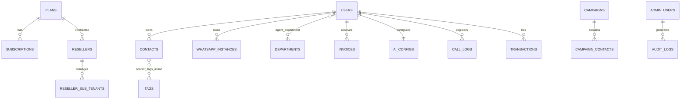

# BANCO_DADOS.md — Arquitetura de Banco de Dados

**Projeto:** SaaS Chatbot / Chatbot_Mauricio  
**Atualizado em:** 2026-07-02  
**Banco identificado:** PostgreSQL 16 (backend Node), MongoDB 7 (mensagens/fluxos), MySQL 8.0 (frontend PHP)

---

## 1. Visão Geral

O sistema utiliza uma estratégia de persistência híbrida:

- **PostgreSQL** armazena dados relacionais e transacionais: usuários, tenants, contatos, planos, assinaturas, faturas, transações, campanhas, configurações de IA e logs administrativos.
- **MongoDB** armazena dados de alta volumetria e estrutura flexível: histórico de mensagens (`chat_history`), definições de fluxos (`flows`) e estados de sessão de fluxo (`flow_sessions`).
- **MySQL** armazena o mínimo necessário para o frontend PHP: usuários locais para autenticação/identificação.
- **Redis** é usado para cache, sessões, rate-limit e controle de presença/LIDs — não persiste dados críticos de negócio.

A estratégia visa isolamento de tenants, suporte a revendas, histórico de chat escalável e flexibilidade na definição de fluxos de automação.

---

## 2. Tecnologia e Ferramentas

| Camada | Banco | ORM / Driver | Migration tool | Seeds | Ambiente local | Ambiente produção |
|--------|-------|--------------|----------------|-------|----------------|-------------------|
| Backend Node | PostgreSQL 16 | Sequelize 6.37.3 | `sequelize.sync({ alter: true })` — NÃO IDENTIFICADO migrations formais | NÃO IDENTIFICADO | Docker (`saas_postgres`) | A CONFIRMAR |
| Backend Node | MongoDB 7 | Mongoose 8.3.1 | Não aplicável | Não aplicável | Docker (`saas_mongo`) | A CONFIRMAR |
| Frontend PHP | MySQL 8.0 | PDO (PHP) | `database/schema.sql` | NÃO IDENTIFICADO | Docker (`saas_mysql`) | A CONFIRMAR |
| Cache/Filas | Redis 7 | ioredis 5.3.2 | Não aplicável | Não aplicável | Docker (`saas_redis`) | A CONFIRMAR |
| Filas | RabbitMQ 3 | amqplib 0.10.3 | Não aplicável | Não aplicável | Docker (`saas_rabbitmq`) | A CONFIRMAR |

> **String de conexão:** NÃO DOCUMENTAR VALORES SENSÍVEIS. As credenciais estão em `.env` e `docker-compose.yml` (exemplo de desenvolvimento).

---

## 3. Localização dos Arquivos de Banco

| Tipo | Caminho | Observação |
|---|---|---|
| Configuração PostgreSQL | `node-version/src/config/database.js` | Conexão Sequelize |
| Configuração MongoDB | `node-version/src/config/database.js` | Conexão Mongoose |
| Configuração Redis | `node-version/src/config/redis.js` | ioredis |
| Configuração RabbitMQ | `node-version/src/config/rabbitmq.js` | amqplib |
| Models SQL (Sequelize) | `node-version/src/models/sql/models.js` | Todas as tabelas relacionais |
| Models NoSQL (Mongoose) | `node-version/src/models/nosql/` | Message, Flow, Knowledge, AuditLog, ErrorReport, RateLimitLog |
| Schema MySQL frontend | `chatbot/database/schema.sql` | Tabela `users` mínima |
| Conexão MySQL frontend | `chatbot/src/Database/Connection.php` | PDO |
| Bootstrap sync | `node-version/server.js` | `sequelize.sync({ alter: true })` |
| Repositórios/Queries | `node-version/src/controllers/`, `services/`, `models/sql/index.js` | Acesso via Sequelize/Mongoose |

---

## 4. Modelo Entidade-Relacionamento



> Diagrama representa as tabelas PostgreSQL do backend Node. Tabelas de join (`contact_tags_assoc`, `agent_department`) são criadas automaticamente pelo Sequelize.

---

## 5. Tabelas / Coleções

### 5.1 `users` (PostgreSQL)

**Finalidade:** Usuários finais da plataforma, atendentes e administradores de tenant.  
**Arquivo/model relacionado:** `node-version/src/models/sql/models.js` (`User`)  
**Migration de origem:** `sequelize.sync({ alter: true })` — NÃO IDENTIFICADO migration formal

| Campo | Tipo | Obrigatório | Default | Chave | Observações |
|---|---|---|---|---|---|
| id | INTEGER | Sim | auto | PK | autoIncrement |
| email | STRING | Sim | — | UNIQUE | Login |
| full_name | STRING | Não | — | — | Nome completo |
| hashed_password | STRING | Sim | — | — | Hash bcrypt |
| is_active | BOOLEAN | Sim | true | — | Conta ativa |
| is_superuser | BOOLEAN | Sim | false | — | Superusuário do tenant |
| tenant_id | STRING | Sim | — | — | Isolamento de tenant |
| reseller_id | INTEGER | Não | null | — | Se criado por revendedor |
| is_agent | BOOLEAN | Sim | false | — | Atendente |
| max_concurrent_chats | INTEGER | Sim | 5 | — | Limite de chats simultâneos |
| current_chats_count | INTEGER | Sim | 0 | — | Contador atual |
| created_at | DATE | Sim | now | — | — |
| updated_at | DATE | Sim | now | — | — |

**Relacionamentos:**
- NxN com `departments` via `agent_department`.

---

### 5.2 `contacts` (PostgreSQL)

**Finalidade:** Contatos dos clientes finais.  
**Arquivo/model relacionado:** `models/sql/models.js` (`Contact`)

| Campo | Tipo | Obrigatório | Default | Chave | Observações |
|---|---|---|---|---|---|
| id | INTEGER | Sim | auto | PK | — |
| phone_number | STRING(50) | Sim | — | — | Número do WhatsApp |
| full_name | STRING(200) | Não | — | — | — |
| is_blacklisted | BOOLEAN | Sim | false | — | — |
| last_campaign_id | INTEGER | Não | — | — | — |
| tenant_id | STRING | Sim | — | FK lógica | — |
| profile_pic_url | TEXT | Não | — | — | Foto do WhatsApp (temporária) |
| is_group | BOOLEAN | Sim | false | — | Grupo do WhatsApp |
| created_at | DATE | Sim | now | — | — |
| updated_at | DATE | Sim | now | — | — |

**Índices:** `phone_number`, `tenant_id`.

**Relacionamentos:**
- NxN com `tags` via `contact_tags_assoc`.

---

### 5.3 `tags` (PostgreSQL)

**Finalidade:** Etiquetas para segmentação de contatos.  
**Arquivo/model relacionado:** `models/sql/models.js` (`Tag`)

| Campo | Tipo | Obrigatório | Default | Chave | Observações |
|---|---|---|---|---|---|
| id | INTEGER | Sim | auto | PK | — |
| name | STRING(50) | Sim | — | — | — |
| color | STRING(20) | Sim | #007bff | — | Cor da tag |
| tenant_id | STRING | Sim | — | — | — |
| created_at | DATE | Sim | now | — | — |

**Relacionamentos:**
- NxN com `contacts` via `contact_tags_assoc`.

---

### 5.4 `whatsapp_instances` (PostgreSQL)

**Finalidade:** Sessões WhatsApp conectadas por tenant.  
**Arquivo/model relacionado:** `models/sql/models.js` (`WhatsAppInstance`)

| Campo | Tipo | Obrigatório | Default | Chave | Observações |
|---|---|---|---|---|---|
| id | INTEGER | Sim | auto | PK | — |
| session_name | STRING(100) | Não | — | UNIQUE | — |
| status | STRING | Sim | DISCONNECTED | — | Enum evitado por `alter: true` |
| webhook_url | STRING(255) | Não | — | — | — |
| external_id | STRING(100) | Não | — | — | — |
| qrcode_base64 | TEXT | Não | — | — | QR code para pareamento |
| battery_level | INTEGER | Sim | 0 | — | — |
| phone_number | STRING(20) | Não | — | — | — |
| is_active | BOOLEAN | Sim | true | — | — |
| last_health_check | DATE | Sim | now | — | — |
| profile_pic_url | TEXT | Não | — | — | Foto do número conectado |
| tenant_id | STRING | Sim | — | — | — |
| updated_at | DATE | Sim | now | — | — |

---

### 5.5 `plans` (PostgreSQL)

**Finalidade:** Planos de assinatura disponíveis.  
**Arquivo/model relacionado:** `models/sql/models.js` (`Plan`)

| Campo | Tipo | Obrigatório | Default | Chave | Observações |
|---|---|---|---|---|---|
| id | INTEGER | Sim | auto | PK | — |
| name | STRING(100) | Sim | — | UNIQUE | — |
| description | STRING(255) | Não | — | — | — |
| price | FLOAT | Sim | 0.0 | — | — |
| currency | STRING(10) | Sim | BRL | — | — |
| max_bots | INTEGER | Sim | 1 | — | — |
| max_agents | INTEGER | Sim | 2 | — | — |
| max_messages_month | INTEGER | Sim | 1000 | — | — |
| is_campaign_enabled | BOOLEAN | Sim | false | — | — |
| is_api_access_enabled | BOOLEAN | Sim | false | — | — |
| is_active | BOOLEAN | Sim | true | — | — |
| created_at | DATE | Sim | now | — | — |

**Relacionamentos:**
- 1xN com `subscriptions`.
- 1xN com `resellers` (plano do revendedor).

---

### 5.6 `subscriptions` (PostgreSQL)

**Finalidade:** Assinatura ativa de cada tenant.  
**Arquivo/model relacionado:** `models/sql/models.js` (`Subscription`)

| Campo | Tipo | Obrigatório | Default | Chave | Observações |
|---|---|---|---|---|---|
| id | INTEGER | Sim | auto | PK | — |
| tenant_id | STRING(50) | Sim | — | UNIQUE | — |
| plan_id | INTEGER | Sim | — | FK | — |
| status | STRING(50) | Sim | active | — | — |
| started_at | DATE | Sim | now | — | — |
| expires_at | DATE | Não | — | — | — |
| last_billing_date | DATE | Sim | now | — | — |
| next_billing_date | DATE | Não | — | — | — |

**Relacionamentos:**
- Nx1 com `plans`.

---

### 5.7 `invoices` (PostgreSQL)

**Finalidade:** Faturas geradas para os tenants.  
**Arquivo/model relacionado:** `models/sql/models.js` (`Invoice`)

| Campo | Tipo | Obrigatório | Default | Chave | Observações |
|---|---|---|---|---|---|
| id | INTEGER | Sim | auto | PK | — |
| invoice_number | STRING(50) | Não | — | UNIQUE | — |
| period_start | DATE | Não | — | — | — |
| period_end | DATE | Não | — | — | — |
| amount | FLOAT | Sim | — | — | — |
| status | STRING(50) | Sim | open | — | — |
| plan_name | STRING(100) | Não | — | — | — |
| pdf_url | STRING(255) | Não | — | — | — |
| paid_at | DATE | Não | — | — | — |
| tenant_id | STRING | Sim | — | — | — |
| created_at | DATE | Sim | now | — | — |

---

### 5.8 `transactions` (PostgreSQL)

**Finalidade:** Transações de pagamento.  
**Arquivo/model relacionado:** `models/sql/models.js` (`Transaction`)

| Campo | Tipo | Obrigatório | Default | Chave | Observações |
|---|---|---|---|---|---|
| id | INTEGER | Sim | auto | PK | — |
| external_id | STRING(100) | Não | — | UNIQUE | ID externo do gateway |
| provider | STRING(50) | Não | — | — | Gateway de pagamento |
| amount | FLOAT | Sim | — | — | — |
| currency | STRING(10) | Sim | BRL | — | — |
| status | STRING(50) | Não | — | — | — |
| payment_method | STRING(50) | Não | — | — | — |
| details | TEXT | Não | — | — | JSON/descritivo |
| tenant_id | STRING | Sim | — | — | — |
| created_at | DATE | Sim | now | — | — |

---

### 5.9 `campaigns` (PostgreSQL)

**Finalidade:** Campanhas de envio de mensagens em massa.  
**Arquivo/model relacionado:** `models/sql/models.js` (`Campaign`)

| Campo | Tipo | Obrigatório | Default | Chave | Observações |
|---|---|---|---|---|---|
| id | INTEGER | Sim | auto | PK | — |
| name | STRING(200) | Sim | — | — | — |
| description | TEXT | Não | — | — | — |
| message_template | TEXT | Sim | — | — | — |
| media_url | STRING(255) | Não | — | — | — |
| scheduled_at | DATE | Não | — | — | — |
| status | STRING(50) | Sim | draft | — | — |
| total_contacts | INTEGER | Sim | 0 | — | — |
| sent_count | INTEGER | Sim | 0 | — | — |
| read_count | INTEGER | Sim | 0 | — | — |
| replied_count | INTEGER | Sim | 0 | — | — |
| error_count | INTEGER | Sim | 0 | — | — |
| min_delay | INTEGER | Sim | 5 | — | segundos |
| max_delay | INTEGER | Sim | 15 | — | segundos |
| sleep_start | INTEGER | Sim | 22 | — | hora |
| sleep_end | INTEGER | Sim | 8 | — | hora |
| is_active | BOOLEAN | Sim | true | — | — |
| tenant_id | STRING | Sim | — | — | — |
| created_at | DATE | Sim | now | — | — |
| updated_at | DATE | Sim | now | — | — |

---

### 5.10 `campaign_contacts` (PostgreSQL)

**Finalidade:** Contatos vinculados a uma campanha e status de envio.  
**Arquivo/model relacionado:** `models/sql/models.js` (`CampaignContact`)

| Campo | Tipo | Obrigatório | Default | Chave | Observações |
|---|---|---|---|---|---|
| id | INTEGER | Sim | auto | PK | — |
| campaign_id | INTEGER | Sim | — | FK | — |
| phone_number | STRING(50) | Sim | — | — | — |
| contact_name | STRING(200) | Não | — | — | — |
| status | STRING(50) | Sim | pending | — | — |
| sent_at | DATE | Não | — | — | — |
| error_message | TEXT | Não | — | — | — |
| tenant_id | STRING | Sim | — | — | — |

**Relacionamentos:**
- Nx1 com `campaigns`.

---

### 5.11 `departments` (PostgreSQL)

**Finalidade:** Departamentos para distribuição de atendentes.  
**Arquivo/model relacionado:** `models/sql/models.js` (`Department`)

| Campo | Tipo | Obrigatório | Default | Chave | Observações |
|---|---|---|---|---|---|
| id | INTEGER | Sim | auto | PK | — |
| name | STRING(100) | Sim | — | — | — |
| description | STRING(255) | Não | — | — | — |
| tenant_id | STRING | Sim | — | — | — |

**Relacionamentos:**
- NxN com `users` via `agent_department`.

---

### 5.12 `ai_configs` (PostgreSQL)

**Finalidade:** Configuração de IA por tenant.  
**Arquivo/model relacionado:** `models/sql/models.js` (`AiConfig`)

| Campo | Tipo | Obrigatório | Default | Chave | Observações |
|---|---|---|---|---|---|
| id | INTEGER | Sim | auto | PK | — |
| tenant_id | STRING | Sim | — | UNIQUE | — |
| provider | STRING(50) | Sim | llama | — | llama, gemini, openai, anthropic, local |
| model | STRING(100) | Sim | llama3.2 | — | — |
| api_key | STRING(255) | Não | — | — | **Armazenado em texto plano** |
| system_prompt | TEXT | Não | — | — | — |
| temperature | FLOAT | Sim | 0.7 | — | — |
| max_tokens | INTEGER | Sim | 1024 | — | — |
| is_rag_enabled | BOOLEAN | Sim | false | — | — |
| is_active | BOOLEAN | Sim | true | — | — |
| created_at | DATE | Sim | now | — | — |
| updated_at | DATE | Sim | now | — | — |

> **Risco de segurança:** `api_key` está em texto plano. Recomenda-se criptografia em repouso.

---

### 5.13 `call_logs` (PostgreSQL)

**Finalidade:** Registro de chamadas de voz.  
**Arquivo/model relacionado:** `models/sql/models.js` (`CallLog`)

| Campo | Tipo | Obrigatório | Default | Chave | Observações |
|---|---|---|---|---|---|
| id | INTEGER | Sim | auto | PK | — |
| tenant_id | STRING | Sim | — | — | — |
| contact_phone | STRING | Sim | — | — | — |
| call_id | STRING | Sim | — | — | — |
| type | STRING | Sim | voice | — | — |
| direction | STRING | Sim | incoming | — | — |
| status | STRING | Sim | ringing | — | — |
| duration | INTEGER | Sim | 0 | — | segundos |
| created_at | DATE | Sim | now | — | — |
| updated_at | DATE | Sim | now | — | — |

---

### 5.14 `admin_users` (PostgreSQL)

**Finalidade:** Administradores da plataforma SaaS, separados de `users`.  
**Arquivo/model relacionado:** `models/sql/models.js` (`AdminUser`)

| Campo | Tipo | Obrigatório | Default | Chave | Observações |
|---|---|---|---|---|---|
| id | INTEGER | Sim | auto | PK | — |
| email | STRING | Sim | — | UNIQUE | — |
| full_name | STRING | Sim | — | — | — |
| hashed_password | STRING | Sim | — | — | Hash bcrypt |
| role | STRING | Sim | readonly | — | superadmin, support, finance, readonly |
| is_active | BOOLEAN | Sim | true | — | — |
| last_login_at | DATE | Não | — | — | — |
| login_count | INTEGER | Sim | 0 | — | — |
| created_at | DATE | Sim | now | — | — |
| updated_at | DATE | Sim | now | — | — |

---

### 5.15 `audit_logs` (PostgreSQL)

**Finalidade:** Trilha de auditoria de ações administrativas.  
**Arquivo/model relacionado:** `models/sql/models.js` (`AuditLog`)

| Campo | Tipo | Obrigatório | Default | Chave | Observações |
|---|---|---|---|---|---|
| id | INTEGER | Sim | auto | PK | — |
| admin_id | INTEGER | Não | — | FK | null = ação de sistema |
| admin_email | STRING | Não | — | — | — |
| admin_role | STRING | Não | — | — | — |
| action | STRING(100) | Sim | — | — | ex: TENANT_BLOCKED |
| entity_type | STRING(50) | Não | — | — | ex: tenant, user |
| entity_id | STRING(100) | Não | — | — | — |
| details | JSONB | Não | — | — | Payload antes/depois |
| ip_address | STRING(50) | Não | — | — | — |
| user_agent | STRING(255) | Não | — | — | — |
| created_at | DATE | Sim | now | — | Imutável — sem updates |

**Relacionamentos:**
- Nx1 com `admin_users`.

---

### 5.16 `resellers` (PostgreSQL)

**Finalidade:** Revendas/white-label da plataforma.  
**Arquivo/model relacionado:** `models/sql/models.js` (`Reseller`)

| Campo | Tipo | Obrigatório | Default | Chave | Observações |
|---|---|---|---|---|---|
| id | INTEGER | Sim | auto | PK | — |
| tenant_id | STRING(50) | Sim | — | UNIQUE | Tenant do próprio revendedor |
| company_name | STRING(200) | Sim | — | — | — |
| plan_id | INTEGER | Não | — | FK | Plano contratado com o SaaS |
| max_sub_tenants | INTEGER | Sim | 10 | — | — |
| commission_pct | FLOAT | Sim | 0.0 | — | % de comissão |
| is_active | BOOLEAN | Sim | true | — | — |
| contact_email | STRING(200) | Não | — | — | — |
| contact_phone | STRING(50) | Não | — | — | — |
| brand_name | STRING(100) | Não | — | — | White-label |
| brand_logo_url | STRING(255) | Não | — | — | — |
| notes | TEXT | Não | — | — | — |
| created_at | DATE | Sim | now | — | — |
| updated_at | DATE | Sim | now | — | — |

**Relacionamentos:**
- Nx1 com `plans`.

---

### 5.17 `reseller_sub_tenants` (PostgreSQL)

**Finalidade:** Mapeamento de sub-tenants pertencentes a cada revendedor.  
**Arquivo/model relacionado:** `models/sql/models.js` (`ResellerSubTenant`)

| Campo | Tipo | Obrigatório | Default | Chave | Observações |
|---|---|---|---|---|---|
| id | INTEGER | Sim | auto | PK | — |
| reseller_id | INTEGER | Sim | — | FK | — |
| sub_tenant_id | STRING(50) | Sim | — | — | Tenant do cliente final |
| status | STRING | Sim | active | — | — |
| plan_id | INTEGER | Não | — | FK | Plano atribuído pelo revendedor |
| suspended_at | DATE | Não | — | — | — |
| suspended_reason | TEXT | Não | — | — | — |
| created_at | DATE | Sim | now | — | — |
| updated_at | DATE | Sim | now | — | — |

**Índices:**
- UNIQUE (`reseller_id`, `sub_tenant_id`)
- `sub_tenant_id`

**Relacionamentos:**
- Nx1 com `resellers`.

---

### 5.18 `chat_history` (MongoDB)

**Finalidade:** Histórico de mensagens trocadas.  
**Arquivo/model relacionado:** `node-version/src/models/nosql/Message.js`

| Campo | Tipo | Obrigatório | Default | Índice | Observações |
|---|---|---|---|---|---|
| tenant_id | String | Sim | — | Sim | — |
| session_name | String | Sim | — | Sim | — |
| contact_phone | String | Sim | — | Sim | — |
| contact_name | String | Não | null | — | — |
| content | String | Sim | — | — | — |
| media_url | String | Não | null | — | — |
| source | String | Sim | user | — | user, agent, system, human |
| message_type | String | Sim | text | — | — |
| external_id | String | Não | null | Sim | ID externo da mensagem |
| flow_id | String | Não | null | — | — |
| timestamp | Date | Sim | Date.now | — | — |
| ack | Number | Sim | 0 | — | 0=Pending, 1=Sent, 2=Delivered, 3=Read |

**Índices compostos:**
- `{ tenant_id: 1, contact_phone: 1, timestamp: -1 }`
- `{ tenant_id: 1, session_name: 1 }`

---

### 5.19 `flows` (MongoDB)

**Finalidade:** Definição visual/lógica de fluxos de chatbot.  
**Arquivo/model relacionado:** `node-version/src/models/nosql/Flow.js`

| Campo | Tipo | Obrigatório | Default | Índice | Observações |
|---|---|---|---|---|---|
| tenant_id | String | Sim | — | Sim | — |
| name | String | Sim | — | — | max 100 chars |
| description | String | Não | null | — | — |
| nodes | Array of flowNode | Não | — | — | Nodes do fluxo |
| edges | Array of flowEdge | Não | — | — | Edges do fluxo |
| trigger_keywords | Array[String] | Não | [] | — | — |
| is_active | Boolean | Sim | true | Sim | — |
| updated_at | Date | Sim | Date.now | — | — |
| version | Number | Sim | 1 | — | — |

**Índices compostos:**
- `{ tenant_id: 1, name: 1 }`
- `{ tenant_id: 1, is_active: 1 }`

---

### 5.20 `flow_sessions` (MongoDB)

**Finalidade:** Estado atual de execução de um fluxo para cada contato.  
**Arquivo/model relacionado:** `node-version/src/models/nosql/Flow.js`

| Campo | Tipo | Obrigatório | Default | Índice | Observações |
|---|---|---|---|---|---|
| tenant_id | String | Sim | — | Sim | — |
| contact_phone | String | Sim | — | Sim | — |
| flow_id | String | Sim | — | Sim | — |
| current_node_id | String | Sim | — | — | — |
| variables | Mixed | Não | {} | — | Variáveis do fluxo |
| last_interaction | Date | Sim | Date.now | — | — |
| is_completed | Boolean | Sim | false | — | — |
| is_human_support | Boolean | Sim | false | — | Transbordo para humano |

---

### 5.21 `knowledge` (MongoDB)

**Finalidade:** Base de conhecimento para RAG.  
**Arquivo/model relacionado:** `node-version/src/models/nosql/Knowledge.js`

| Campo | Tipo | Obrigatório | Default | Índice | Observações |
|---|---|---|---|---|---|
| tenant_id | String | Sim | — | Sim | — |
| content | String | Sim | — | — | Texto do documento |
| source | String | Não | — | — | Origem do documento |
| metadata | Mixed | Não | {} | — | — |
| created_at | Date | Sim | Date.now | — | — |

---

### 5.22 Coleções auxiliares NoSQL

| Coleção | Finalidade | Arquivo | Observações |
|---|---|---|---|
| `audit_logs` (MongoDB) | Logs de erros/auditoria | `models/nosql/AuditLog.js` | A CONFIRMAR se usado em produção |
| `error_reports` (MongoDB) | Relatórios de erro | `models/nosql/ErrorReport.js` | A CONFIRMAR |
| `rate_limit_logs` (MongoDB) | Logs de rate-limit | `models/nosql/RateLimitLog.js` | A CONFIRMAR |

---

### 5.23 `users` (MySQL — frontend PHP)

**Finalidade:** Usuários locais do painel PHP.  
**Arquivo/model relacionado:** `chatbot/database/schema.sql`

| Campo | Tipo | Obrigatório | Default | Chave | Observações |
|---|---|---|---|---|---|
| id | INT UNSIGNED | Sim | auto | PK | AUTO_INCREMENT |
| name | VARCHAR(120) | Sim | — | — | — |
| email | VARCHAR(190) | Sim | — | UNIQUE | — |
| created_at | TIMESTAMP | Sim | CURRENT_TIMESTAMP | — | — |

> **Observação:** a autenticação real do frontend parece usar a API Node (JWT), tornando essa tabela local de uso limitado ou legado.

---

## 6. Migrações

### Backend Node (PostgreSQL + MongoDB)

Não há migrations formais identificadas. O schema é gerenciado por:

```javascript
await sequelize.sync({ alter: true });
```

localizado em `node-version/server.js`.

| Ordem | Arquivo | Descrição | Status |
|---|---|---|---|
| 1 | `node-version/server.js` | `sequelize.sync({ alter: true })` | Ativo (não é migration formal) |
| — | NÃO IDENTIFICADO | Sequelize CLI migrations | PENDENTE |
| — | NÃO IDENTIFICADO | Alembic (Python legado) | Inativo |

### Como rodar "migrations" atuais

```bash
cd node-version
npm install
npm run start
# sequelize.sync({ alter: true }) executa automaticamente
```

### Frontend PHP (MySQL)

```bash
cd chatbot
mysql -u root -p chatbot_db < database/schema.sql
```

### Política recomendada

- Nunca editar migration já aplicada em produção; criar nova migration corretiva.
- Evitar `alter: true` em produção sem backup e validação prévia.
- Adotar Sequelize CLI ou ferramenta equivalente para controle de schema.

---

## 7. Seeds e Dados Iniciais

| Arquivo | Banco | Descrição | Status |
|---|---|---|---|
| NÃO IDENTIFICADO | PostgreSQL | Seed de admin master | NÃO IDENTIFICADO |
| NÃO IDENTIFICADO | PostgreSQL | Seed de planos iniciais | NÃO IDENTIFICADO |
| `chatbot/database/schema.sql` | MySQL | Cria tabela `users` | Confirmado |

**Como executar seeds:**

- MySQL frontend: `mysql -u root -p chatbot_db < chatbot/database/schema.sql`
- PostgreSQL backend: NÃO IDENTIFICADO seeds formais.

> **Usuários padrão:** NÃO IDENTIFICADO. Não expor senhas reais na documentação.

---

## 8. Repositórios, Queries e Acesso a Dados

### Camada de acesso a dados

- **Backend Node:** acesso direto via Sequelize e Mongoose nos controllers e services. Não há camada de repositório abstrata identificada.
- **Frontend PHP:** PDO em `chatbot/src/Database/Connection.php`.

### Padrões identificados

- Isolamento de tenant por `tenant_id` em praticamente todas as tabelas/coleções.
- Uso de `AsyncLocalStorage` (`tenancyMiddleware.js`) para propagar `tenant_id` no contexto assíncrono.
- Associações Sequelize para relacionamentos NxN e 1xN.
- Indexes explícitos em `contacts` e `reseller_sub_tenants`.

### Queries críticas

- Busca de histórico por tenant + telefone + timestamp: `chat_history` com índice composto.
- Listagem de conversas ativas por `tenant_id` e `session_name`.
- Contadores de campanha (`sent_count`, `read_count`, etc.) atualizados por workers.

### Pontos de performance

- MongoDB sem TTL/política de retenção documentada para `chat_history`.
- PostgreSQL sem índices explícitos em `users.tenant_id`, `invoices.tenant_id`, `transactions.tenant_id` — podem ser necessários em escala.
- Uso de `sequelize.sync({ alter: true })` pode adicionar colunas, mas não otimiza índices automaticamente.

---

## 9. Índices e Performance

### Índices existentes

| Tabela/Coleção | Índice | Campos | Motivo |
|---|---|---|---|
| `contacts` | Simples | `phone_number` | Busca por telefone |
| `contacts` | Simples | `tenant_id` | Isolamento de tenant |
| `reseller_sub_tenants` | UNIQUE | `reseller_id`, `sub_tenant_id` | Evitar duplicidade |
| `reseller_sub_tenants` | Simples | `sub_tenant_id` | Busca por sub-tenant |
| `chat_history` | Composto | `tenant_id`, `contact_phone`, `timestamp` | Histórico de conversa |
| `chat_history` | Composto | `tenant_id`, `session_name` | Listar conversas |
| `flows` | Composto | `tenant_id`, `name` | Busca de fluxo por nome |
| `flows` | Composto | `tenant_id`, `is_active` | Listar fluxos ativos |
| `flow_sessions` | Simples | `tenant_id`, `contact_phone`, `flow_id` | Sessões por contato |

### Índices sugeridos

| Tabela/Coleção | Índice | Campos | Motivo |
|---|---|---|---|
| `users` | Simples | `tenant_id` | Listar usuários do tenant |
| `users` | Simples | `email` | Login rápido |
| `whatsapp_instances` | Simples | `tenant_id` | Buscar instância por tenant |
| `invoices` | Simples | `tenant_id` | Listar faturas |
| `transactions` | Simples | `tenant_id` | Listar transações |
| `campaigns` | Simples | `tenant_id`, `status` | Listar campanhas ativas |
| `campaign_contacts` | Simples | `tenant_id`, `status` | Contatos pendentes |
| `chat_history` | TTL | `timestamp` | Expurgo automático de mensagens antigas |

---

## 10. Integridade, Constraints e Validações

### Foreign Keys

- `subscriptions.plan_id` → `plans.id` (1xN).
- `campaign_contacts.campaign_id` → `campaigns.id` (1xN).
- `resellers.plan_id` → `plans.id` (Nx1).
- `reseller_sub_tenants.reseller_id` → `resellers.id` (Nx1).
- `admin_users` → `audit_logs` (1xN).

### Unique constraints

- `users.email`
- `tags` — NÃO IDENTIFICADO constraint unique por tenant (risco de nomes duplicados por tenant).
- `plans.name`
- `subscriptions.tenant_id`
- `invoices.invoice_number`
- `transactions.external_id`
- `resellers.tenant_id`
- `reseller_sub_tenants` (`reseller_id`, `sub_tenant_id`)
- `ai_configs.tenant_id`
- `whatsapp_instances.session_name`

### Check constraints

- NÃO IDENTIFICADO explicitamente. Validações são feitas em aplicação (Zod, Sequelize allowNull).

### Cascades

- NÃO IDENTIFICADO `ON DELETE CASCADE` explícito. Remoção de entidades pode deixar órfãos.

### Soft delete

- NÃO IDENTIFICADO. Tabelas usam `is_active` como desativação lógica, mas não há campo `deleted_at`.

### Timestamps

- `created_at` e `updated_at` em quase todas as tabelas.
- `audit_logs` tem apenas `created_at` (imutável).
- `plans` e `campaigns` com `created_at` e `updated_at`.

### Auditoria

- `audit_logs` registra ações administrativas com payload JSON, IP e user agent.
- `RateLimitLog` (MongoDB) e `ErrorReport` (MongoDB) para logs operacionais.

---

## 11. Segurança dos Dados

### Dados sensíveis

- `hashed_password` (users e admin_users) — hash bcrypt, confirmado.
- `api_key` em `ai_configs` — **armazenado em texto plano** (risco).
- Tokens JWT — transitam em headers, não armazenados no banco.
- Dados de contato e mensagens — considerados dados pessoais.

### LGPD

- NÃO IDENTIFICADO política de consentimento, anonimização ou direito ao esquecimento.
- Recomenda-se mapear finalidade e retenção dos dados pessoais.

### Criptografia/hash

- bcrypt para senhas.
- NÃO IDENTIFICADO criptografia de dados sensíveis em repouso (ex: `api_key`, `details` de transações).

### Controle de acesso

- Isolamento por `tenant_id`.
- Revendas controlam sub-tenants.
- Admin roles restringem ações no painel administrativo.

### RLS (Row Level Security)

- NÃO IDENTIFICADO no PostgreSQL. Isolamento é feito em aplicação.

### Backups

- NÃO IDENTIFICADO rotina de backup.
- Docker volumes persistentes (`postgres_data`, `mongo_data`, `mysql_data`).

### Logs

- Logs de aplicação em `logs/logs.txt`.
- `audit_logs` para ações administrativas.

---

## 12. Pendências e Riscos

| Item | Risco | Severidade | Ação recomendada |
|---|---|---|---|
| Ausência de migrations formais | Schema alterado automaticamente em produção | Alta | Adotar Sequelize CLI ou ferramenta similar |
| `api_key` em texto plano | Exposição de credenciais de IA | Alta | Criptografar campo em repouso |
| Sem RLS no PostgreSQL | Isolamento depende exclusivamente da aplicação | Média | Considerar RLS ou validações reforçadas |
| Sem TTL no MongoDB | Crescimento ilimitado de `chat_history` | Média | Definir política de retenção e TTL |
| Sem backups documentados | Perda de dados em desastre | Média | Documentar e automatizar backups |
| Sem índices em `users.tenant_id` e outras | Degradação de performance em escala | Média | Adicionar índices conforme uso |
| Sem soft delete | Dados removidos permanentemente | Baixa | Avaliar `deleted_at` ou `is_deleted` |
| Sem seeds formais | Dificuldade para replicar ambiente | Média | Criar seeds para admin master e planos |
| Sem testes de banco | Mudanças de schema não validadas | Alta | Adicionar testes de migrations/models |
