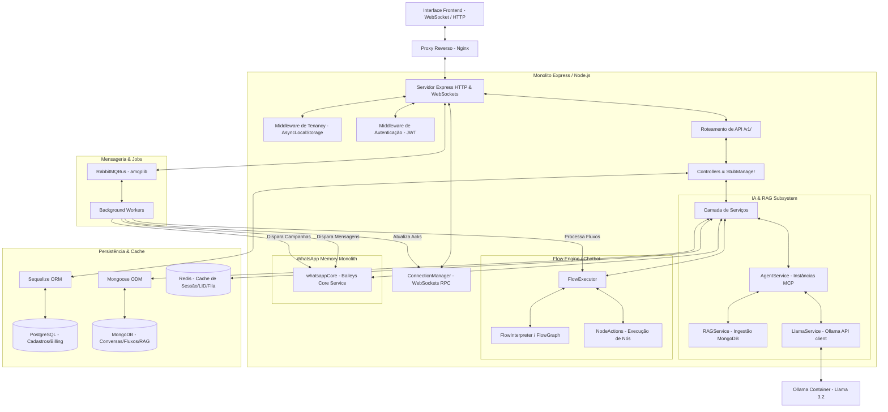

# 🌌 Relatório de Auditoria e Análise Minuciosa do Backend (Node.js)

Este documento apresenta a análise técnica detalhada do backend em **Node.js (Monolito em Memória)** do projeto **SaaS-Chatbot**. O sistema foi migrado do ecossistema legou em C# / FastAPI e integra um núcleo de mensagens nativo, orquestração de chatbot baseada em fluxos (Flow Engine), processamento de Inteligência Artificial local (Llama 3.2 via Ollama), barramento de mensagens assíncrono (RabbitMQ), cache estruturado (Redis), banco de dados relacional (PostgreSQL) e não-relacional (MongoDB).

---

## 🏛️ 1. Arquitetura Geral & Componentes do Sistema

O backend do SaaS-Chatbot é estruturado de forma a otimizar a latência e simplificar a comunicação entre microsserviços por meio de um **Monolito em Memória**. Em vez de fazer requisições HTTP para pontes externas (como Venom-Bridge), o próprio backend gerencia as instâncias do WhatsApp via `@whiskeysockets/baileys` diretamente no Event Loop do Node.js.

### 🧩 Diagrama de Relacionamento dos Componentes do Sistema

---

## 🔒 2. Mecanismos Principais de Infraestrutura

### 2.1. Multi-Tenancy Hermético (AsyncLocalStorage & Sequelize Hooks)
O isolamento de dados de nível SaaS é implementado de forma transparente nas camadas do banco de dados e controle de requisição:
1. **AsyncLocalStorage (`tenancyMiddleware.js`):** Um contexto de execução assíncrona intercepta toda requisição HTTP e extrai o ID do tenant (`X-Tenant-ID` nos headers ou Query string). O id é gravado em um store assíncrono chamado `tenancyContext`.
2. **Sequelize Hooks Globais (`models/sql/index.js`):** A instância principal do Sequelize aplica hooks automáticos em toda a árvore de modelos relacionais:
   - `beforeFind`: Injeta automaticamente a cláusula `WHERE tenant_id = 'TENANT_ID'` em todas as seleções.
   - `beforeCreate`: Popula automaticamente o campo `tenant_id` com o valor ativo no contexto.
   - `beforeUpdate` / `beforeDestroy`: Restringe as operações ao tenant ativo.
   - **Bypass de Segurança (`ignoreTenant`):** Para rotas de webhooks globais e crons, a query pode explicitamente declarar `ignoreTenant: true` para buscar em todo o banco.

### 2.2. Protocolo de Comunicação WebSockets (`connectionManager.js`)
Substitui o mecanismo SignalR do .NET original por uma implementação de WebSockets brutos altamente otimizada:
* **Identificação JWT:** As conexões exigem a passagem do token JWT na query string, o qual valida o `tenant_id` e o `user_id`.
* **Multiplexação por Tenant:** Mantém uma estrutura em memória `activeConnections[tenantId][userId] = [ws_client_1, ws_client_2]`, permitindo disparos direcionados a um operador específico (`sendPersonalMessage`) ou transmissões gerais para toda a equipe do tenant (`broadcastToTenant`).
* **Deduplicação Semântica de Mensagens:** Implementa um cache temporário em memória (`lastSentMessageByContact`) indexado por contato. Se uma mensagem contendo exatamente o mesmo conteúdo para o mesmo destinatário for gerada em uma janela de 30 segundos, ela é bloqueada na camada de WebSocket para evitar re-entregas ou poluição visual na interface do usuário.

---

## 📳 3. WhatsApp Memory Monolith (`whatsappCore.js`)

A integração nativa com o WhatsApp é mantida em memória no processo Node.js por meio da biblioteca Baileys. O serviço `whatsappCore.js` é responsável por:
1. **Autenticação em Multi-Pastas:** Salva o estado de autenticação e credenciais criptográficas em subpastas dinâmicas: `tokens/tenant_{tenantId}` via `useMultiFileAuthState()`.
2. **Resolução de JID LID (Linked Device Identifiers):** Com o avanço do protocolo do WhatsApp, múltiplos IDs são reportados em formato `@lid` em vez de `@s.whatsapp.net`. O `whatsappCore` executa uma estratégia em 4 camadas de resolução:
   - **participantPn / senderPn:** Captura o número do telefone real do remetente injetado diretamente no cabeçalho do payload do Baileys.
   - **Cache em Memória (`lidMaps`):** Associa o LID ao telefone resolvido na sessão atual.
   - **Cache no Redis (`lid_map:${tenantId}:${remoteJid}`):** Persiste a associação por 30 dias para evitar buscas repetidas após reinicializações.
   - **Scan de Contatos (Baileys Store):** Caso o cache falhe, faz uma busca exaustiva no banco de contatos sincronizados pelo Baileys em tempo real.
3. **Resolução do 9º Dígito Brasileiro:** O script `phoneUtils.js` normaliza números de telefone garantindo o formato canônico com 13 dígitos (`55 + DDD + 9 + 8 dígitos`). Para envios, se o número falhar na rede oficial, o serviço tenta adicionar ou remover dinamicamente o 9º dígito por meio de consultas `sock.onWhatsApp(alternateJid)` antes do disparo de mídia ou texto.
4. **Prevenção de Duplicidade no Banco de Dados:** Antes de salvar mensagens de entrada (`notify`) ou de saída (`fromMe`), faz uma verificação de duplicidade utilizando o `external_id` (o ID único da mensagem gerado pelo WhatsApp), garantindo que mensagens repetidas pelo protocolo não gerem registros duplicados no MongoDB.

---

## 🤖 4. Flow Engine & Inteligência Artificial (Llama 3.2 + RAG)

O sistema de chatbot baseia-se em fluxos visuais do tipo "grafo" integrados a modelos de linguagem locais (Llama 3.2).

### 4.1. Mecanismo de Execução de Fluxos (`FlowExecutor.js` & `FlowInterpreter.js`)
* **Representação Gráfica (`FlowInterpreter.js`):** Converte a definição em JSON (nós e arestas criados no FlowBuilder do frontend) em listas de adjacências direcionadas (`adj` e `rev_adj`). Identifica o nó de entrada (`start` / `trigger`).
* **Estado de Sessão (`SessionState`):** O estado da conversa é persistido no MongoDB para registrar em qual nó o contato está atualmente (`current_node_id`), quais variáveis foram capturadas (`variables`) e se o fluxo foi transferido para suporte humano (`is_human_support`).
* **Nós de Execução (`NodeActions.js`):**
  - **Message:** Envia mensagens estáticas ou dinâmicas via WhatsApp. O interpretador injeta valores de variáveis salvas usando expressão regular `{{nome_variavel}}`.
  - **AI / Gemini (Llama 3.2):** Processa a entrada do usuário por meio de prompts de sistema personalizados, reunindo as últimas 10 interações do contato para formar o histórico de conversação (`LlamaService.buildHistoryFromMessages`).
  - **Handover:** Libera o contato do fluxo de automação, busca atendentes online disponíveis no Redis (`presence:${tenantId}:${userId}`) que estejam abaixo do limite de capacidade (`max_concurrent_chats`) e transmite o evento `chat_assigned` no WebSocket.
  - **A/B Testing (`ab_split`):** Realiza uma divisão estatística uniforme de 50/50, encaminhando o contato aleatoriamente para o caminho A ou caminho B do fluxo.

### 4.2. Instância MCP Isolada por Tenant (`agentService.js`)
Garante que a Inteligência Artificial funcione como uma instância do **Model Context Protocol (MCP)** isolada:
1. **Model & Provider Configuration (`AiConfig`):** Cada tenant possui sua própria configuração de IA no PostgreSQL (provider, modelo, chaves de API, prompts de sistema, temperatura e flag de ativação de RAG).
2. **Isolamento de Conhecimento RAG (`ragService.js`):** Quando o RAG está ativo, a mensagem do usuário é dividida em termos chave de busca e executada uma query de busca de texto (`regex`) na coleção `Knowledge` filtrada obrigatoriamente por `tenant_id`. Isso garante que informações confidenciais de uma base de dados nunca vazem para outro tenant.

---

## 📊 5. Faturamento, Limites de Uso & Notificações (Billing & Quotas)

O controle SaaS assegura a saúde financeira e operacional da aplicação:
* **Fila de Faturamento (`quotaService.js`):** Cada mensagem disparada increments uma chave no Redis: `usage:${tenantId}:messages:${YYYY-MM}` com validade mensal. Se o contador exceder o limite contratado no plano do tenant (`max_messages_month`), o envio é bloqueado com um alerta de cota atingida. Limites também são verificados em banco para criação de novos bots (`max_bots`) e agentes atendentes (`max_agents`).
* **Cobranças e Webhooks (`paymentService.js`):** Gera transações com status inicial `pending` contendo links de checkout e códigos de PIX simulados. Ao receber requisições de webhooks de provedores de pagamento (como Mercado Pago), localiza a transação pelo ID externo sem limitação de tenancy (bypass de segurança) e adiciona 30 dias de validade à assinatura (`Subscription`) do tenant correspondente.
* **Billing Heartbeat (`billingNotificationService.js`):** Rotina programada executada a cada 12 horas:
  1. Identifica assinaturas que expirarão em menos de 3 dias e gera logs de alerta.
  2. Suspende automaticamente tenants com assinaturas expiradas (alterando status para `past_due`) e delega à camada `invoicingService.js` a emissão de uma nova fatura com status `open`.

---

## 🗄️ 6. Catálogo do Banco de Dados (Modelos Relacionais e Coleções NoSQL)

### 6.1. PostgreSQL (Sequelize) - Estrutura Relacional
Tabelas essenciais para o gerenciamento de usuários, assinaturas, contas, campanhas e configurações:

| Modelo (Model) | Tabela (Table) | Descrição do Papel no Sistema |
| :--- | :--- | :--- |
| **User** | `users` | Registra os operadores, credenciais criptografadas com bcrypt, permissões superuser/agent e limites de chats simultâneos. |
| **Contact** | `contacts` | Leads registrados no CRM do tenant. Possui indexadores em `phone_number` e `tenant_id` para aceleração de buscas. |
| **Tag** | `tags` | Segmentação personalizada de leads (ex: "Quente", "Inadimplente"). Relaciona-se NxN com `contacts`. |
| **WhatsAppInstance** | `whatsapp_instances` | Persiste o status de conexão da sessão do Baileys (`DISCONNECTED`, `CONNECTING`, `QRCODE`, `CONNECTED`, `ERR_SESSION`), chaves base64 do QR Code e estatísticas de integridade. |
| **Plan** | `plans` | Configuração de planos (preço, limites de bots, agentes, volume de mensagens mensais e recursos ativados). |
| **Subscription** | `subscriptions` | Associa um tenant a um plano ativo. Não usa mixin de tenancy padrão (pois define a propriedade do tenant). |
| **Invoice** | `invoices` | Histórico de faturas geradas mensalmente para cobrança dos tenants. |
| **Transaction** | `transactions` | Registro histórico de transações financeiras disparadas via gateways (Mercado Pago, Pix, Stripe). |
| **Campaign** | `campaigns` | Definição de campanhas de disparo em massa (template de texto, atraso antibloqueio, horário de silêncio e contadores de envio). |
| **CampaignContact** | `campaign_contacts` | Fila individualizada contendo o status de entrega para cada número de telefone participante da campanha. |
| **Department** | `departments` | Setor organizacional (Vendas, Suporte). Relaciona-se NxN com operadores (`users`) para filas de atendimento. |
| **AiConfig** | `ai_configs` | Configuração isolada da IA para cada tenant (modelos, prompts, temperatura e flags de RAG). |

### 6.2. MongoDB (Mongoose) - Estrutura Não-Relacional
Coleções otimizadas para processamento massivo, histórico de conversas em tempo real e fluxos de grafos complexos:

* **Message (`Message.js`):** Guarda todas as mensagens trafegadas no sistema.
  - Campos: `tenant_id`, `session_name`, `contact_phone`, `contact_name`, `content`, `source` (agent/user), `message_type` (text/media), `external_id`, `ack` (0=pending, 1=sent, 2=delivered, 3=read, 4=error), `timestamp`.
* **Flow (`Flow.js`):** Armazena os fluxos configurados no FlowBuilder.
  - Campos: `tenant_id`, `name`, `nodes` (Array de nós do grafo), `edges` (Array de conexões/arestas), `trigger_keywords` (Palavras gatilho para início), `version`, `is_active`.
* **Knowledge (`Knowledge.js`):** Armazena os fragmentos de texto ingeridos para o sistema de RAG (base de conhecimento de IA).
  - Campos: `tenant_id`, `content` (fragmento de texto), `metadata` (fonte do documento, indexador do chunk).

---

## 📬 7. Diretório de Endpoints (Rotas da API Express)

O arquivo `routes.js` define as seguintes rotas da API em Node.js (mapeadas em OpenAPI/Swagger):

### 🔑 7.1. Autenticação & Cadastro (`auth`)
* `POST /api/v1/auth/register`: Criação de novo usuário e geração de novo `tenant_id` aleatório de 8 caracteres.
* `POST /api/v1/auth/login`: Autenticação compatível com OAuth2 (username/password) ou REST clássico. Retorna tokens Access JWT e Refresh.
* `POST /api/v1/auth/refresh`: Atualização de token de acesso expirado usando token de atualização.
* `GET /api/v1/auth/me`: Retorna os dados do usuário autenticado no cabeçalho `Authorization`.
* `POST /api/v1/auth/change-password`: Modificação de senha com validações de complexidade de segurança do usuário.
* `POST /api/v1/auth/password-recovery/{email}`: *[Stub]* Rota de recuperação de senha.
* `POST /api/v1/auth/reset-password`: *[Stub]* Redefinição de senha com token de validação.

### 🔌 7.2. Gateway de Integração Externa (`gateway`)
* `POST /api/v1/gateway/webhook/:channel_type`: Recebe webhooks de eventos externos (como Venom/Evolution de outros canais), normaliza o payload e distribui eventos WebSockets.

### 🤖 7.3. Automação de Fluxos (`flows`)
* `GET /api/v1/flows/`: Retorna o fluxo configurado ativo do tenant logado.
* `POST /api/v1/flows/`: Cria ou atualiza a versão do grafo do fluxo do tenant.
* `GET /api/v1/flows/:flow_id`: *[Stub]* Busca fluxo por ID específico.
* `PATCH /api/v1/flows/:flow_id`: *[Stub]* Atualiza fluxo parcialmente.
* `DELETE /api/v1/flows/:flow_id`: *[Stub]* Remove um fluxo da base.

### 💬 7.4. Serviço de Chat em Tempo Real (`chat`)
* `POST /api/v1/chat/send`: Dispara mensagem manual enviada por um atendente. Passa pelo middleware de validação de contrato do telefone, cria registro pendente no Mongo e enfileira no RabbitMQ.
* `GET /api/v1/chat/history/:conversation_id`: Busca o histórico paginado de mensagens de um contato.
* `GET /api/v1/chat/conversations`: Retorna a lista de últimas conversas do tenant agrupadas via agregação do MongoDB.
* `GET /api/v1/chat/conversations/:conversation_id`: Retorna o histórico de mensagens formatado para o frontend legado.
* `POST /api/v1/chat/typing`: *[Stub]* Notificação que o agente está digitando.
* `POST /api/v1/chat/transfer/:conversation_id`: *[Stub]* Transfere atendimento do contato para outro operador.
* `GET /api/v1/chat/presence/:user_id`: *[Stub]* Consulta se atendente está online no Redis.

### 📳 7.5. Controle de Bot do WhatsApp (`bot`)
* `GET /api/v1/bot/`: Retorna o status de conexão da instância do tenant.
* `GET /api/v1/bot/qr`: Retorna fluxo Server-Sent Events (SSE) que transmite atualizações em tempo real do QR Code de conexão.
* `POST /api/v1/bot/start`: Inicializa a sessão em memória Baileys do tenant e muda status para `CONNECTING`.
* `POST /api/v1/bot/stop`: Encerra a conexão WebSocket Baileys e remove o socket da memória.
* `POST /api/v1/bot/restart`: Para e reinicia a sessão do bot.
* `DELETE /api/v1/bot/logout`: Desconecta a conta de WhatsApp, deleta chaves criptográficas da pasta `tokens/` do tenant e redefine o status.

### 💳 7.6. Planos & Faturamento (`billing`)
* `GET /api/v1/billing/plans`: Lista planos ativos públicos para assinatura.
* `GET /api/v1/billing/dashboard`: Retorna métricas consolidadas de faturas abertas e pagamentos do tenant.
* `POST /api/v1/billing/checkout/:plan_id`: Registra transação Pix pendente e gera link de checkout.
* `POST /api/v1/billing/webhook/:provider`: Recebe notificações assíncronas do Mercado Pago para processar a aprovação da assinatura.
* `GET /api/v1/billing/my-subscription`: *[Stub]* Busca assinatura do tenant.
* `POST /api/v1/billing/subscribe/:plan_id`: *[Stub]* Subscreve o tenant a um plano.

### 📢 7.7. Campanhas de Disparo Massivo (`campaigns`)
* `POST /api/v1/campaigns/`: Cria um rascunho de campanha em lote.
* `POST /api/v1/campaigns/:id/schedule`: Agenda o envio da campanha, mudando status para `scheduled` e disparando evento inicial no RabbitMQ.
* `GET /api/v1/campaigns/`: Retorna a lista de campanhas criadas do tenant.
* `POST /api/v1/campaigns/:id/pause`: *[Stub]* Pausa o disparo de campanhas em andamento.

### 👤 7.8. Gestão de Contatos & CRM (`contacts`)
* `GET /api/v1/contacts/`: Lista contatos cadastrados no PostgreSQL com suas tags de relacionamento paginados.
* `POST /api/v1/contacts/`: Cria contato validando o contrato de telefone de 13 dígitos.
* `GET /api/v1/contacts/whatsapp`: Lista contatos nativos carregados da agenda telefônica emparelhada no Baileys.
* `POST /api/v1/contacts/whatsapp`: Verifica a validade do contato na rede oficial via Baileys e o persiste no CRM do banco de dados local.
* `PUT /api/v1/contacts/whatsapp/:phone`: Executa a atualização cadastral do lead no banco e no WhatsApp.
* `DELETE /api/v1/contacts/whatsapp/:phone`: Remove contato do banco e exclui registros locais da sessão.
* `POST /api/v1/contacts/import`: *[Stub]* Importa lista de contatos em lote via arquivos CSV.
* `POST /api/v1/contacts/:phone/opt-out`: *[Stub]* Ativa exclusão de recebimento de campanhas para o número.
* `GET /api/v1/contacts/tags`: *[Stub]* Lista tags criadas para segmentação.

### 📞 7.9. Chamadas de Voz via WhatsApp (`calls`)
* `POST /api/v1/calls/start`: Inicia chamada de voz nativa Baileys no celular do lead.
* `POST /api/v1/calls/reject`: Rejeita chamada entrante do lead.

### 🧠 7.10. IA & Configuração RAG (`AI`)
* `GET /api/v1/ai/config`: Retorna a configuração ativa de IA (Llama/Gemini).
* `POST /api/v1/ai/config`: Atualiza parâmetros como prompts, temperatura e chave RAG.
* `POST /api/v1/rag/ingest`: Recebe documento do tenant, quebra em blocos de até 1000 caracteres e os persiste na coleção `Knowledge` do MongoDB.
* `DELETE /api/v1/rag/clear`: Exclui todos os fragmentos de conhecimento ingeridos do tenant.

---

## ⚙️ 8. Mapeamento de Workers em Segundo Plano (RabbitMQ Consumidores)

Para manter o Express livre de bloqueios do Event Loop ao processar tarefas lentas, o sistema delega tarefas a 4 Workers assíncronos que consomem as filas do RabbitMQ:

### 8.1. `flowWorker.js`
* **Assinatura:** Fila `incoming_flow_queue` (Exchange: `messages_exchange`, Key: `message.incoming`).
* **Operação:** Disparado sempre que uma mensagem é recebida de um contato no WhatsApp nativo.
  1. Identifica se há algum fluxo do tenant ativo.
  2. Localiza ou instancia a sessão de estado (`SessionState`) daquele contato no MongoDB.
  3. Se a sessão estiver sob `is_human_support` (handover ativo), ignora e atualiza o marcador temporal de última interação.
  4. Caso contrário, invoca o `FlowExecutor` passando o nó atual da sessão e a mensagem do usuário para processar as regras condicionais de mudança de nós.

### 8.2. `campaignWorker.js`
* **Assinatura:** Fila `campaign_processing_queue` (Exchange: `campaign_exchange`, Key: `campaign.start`).
* **Operação:** Disparado ao iniciar o envio de uma campanha em massa.
  1. Altera o status da campanha de `scheduled` para `sending`.
  2. Recupera todos os contatos associados com status `pending`.
  3. Identifica as instâncias de bots conectados ativos daquele tenant.
  4. Realiza o disparo cíclico distribuindo as mensagens entre os bots disponíveis via `whatsappService.sendMessage`.
  5. Controles antibloqueio:
     - **Horário de silêncio:** Se a hora local estiver entre os horários configurados (ex: 22h às 8h), o worker entra em modo dormente de 10 minutos por loop.
     - **Delay antiban:** Executa um temporizador aleatório entre os segundos limites configurados (ex: `min_delay` a `max_delay`) antes de puxar o próximo contato da fila.
  6. Atualiza contadores de progresso e finaliza o status para `completed` quando todos os contatos forem processados.

### 8.3. `ackWorker.js`
* **Assinatura:** Fila `message_ack_queue` (Exchange: `messages_exchange`, Key: `message.ack`).
* **Operação:** Rastreia as notificações de entrega e leitura do WhatsApp.
  1. Mapeia os status numéricos do Baileys para strings do sistema (3 = `delivered`, 4 = `read`, 5 = `error`).
  2. Localiza a mensagem na coleção do MongoDB pelo seu `external_id` e atualiza o status.
  3. Transmite via WebSocket RPC com o método `update_message_status` para que o frontend do atendente atualize visualmente os checks de leitura da mensagem de forma instantânea.

### 8.4. `outgoingWorker.js`
* **Assinatura:** Fila `outgoing_whatsapp_queue` (Exchange: `messages_exchange`, Key: `message.outgoing`).
* **Operação:** Consome mensagens enviadas manualmente por atendentes ou por disparos rápidos de fluxos.
  1. Localiza a última instância ativa e conectada do tenant no Postgres.
  2. Executa a entrega nativa chamando diretamente o socket Baileys em memória.
  3. **Mecanismo de Retentativa (Backoff Exponencial):** Se o envio falhar por indisponibilidade momentânea, o worker executa até 3 tentativas de reenvio, dobrando o tempo de espera entre cada falha (`1s -> 2s -> 4s`), prevenindo perda de mensagens por falhas de handshake da rede.

---

## 🔍 9. Auditoria Detalhada dos Scripts de Utilitários e Infraestrutura

Abaixo encontra-se a análise funcional e estrutural de cada script de apoio no backend:

### ⚙️ 9.1. `utils/phoneUtils.js`
* **Objetivo:** Garantir a padronização absoluta de números de telefone nacionais.
* **Lógica:** Remove caracteres não numéricos. Se o número não possuir DDI (55), o injeta automaticamente. No Brasil, se o DDD e número possuírem 12 dígitos, ele injeta o `9` na 5ª posição. Se possuir 13 dígitos mas a 5ª posição não for o dígito `9`, força a alteração corrigindo para o padrão mobile. Retorna o número pronto para banco de dados ou formatado como JID do WhatsApp (`@s.whatsapp.net`).

### ⚙️ 9.2. `utils/sessionMapper.js`
* **Objetivo:** Resolver problemas de rotatividade de chaves de sessão.
* **Lógica:** Mantém um mapa em memória relacionando o ID físico da sessão (gerado aleatoriamente) com o padrão lógico do Tenant (`tenant_TENANT_ID`). Permite consultas bidirecionais instantâneas sem a necessidade de requisições de leitura de tabelas ao banco relacional a cada mensagem que transita nos webhooks ou sockets.

### ⚙️ 9.3. `utils/messageNormalizer.js`
* **Objetivo:** Normalizar payloads recebidos do WhatsApp externo.
* **Lógica:** Converte payloads de diferentes versões de bridges externos (Venom, Evolution API) no formato unificado de mensagem esperado pelo Mongoose local, mapeando os remetentes, timestamps, IDs únicos e corpos de texto de maneira homogênea.

### ⚙️ 9.4. `config/database.js`
* **Objetivo:** Estabelecer conexões simultâneas com PostgreSQL (Sequelize) e MongoDB (Mongoose).
* **Lógica:** Inicializa os pools de conexão de dados relacionais e orientados a documentos, disparando logs detalhados de depuração em desenvolvimento e derrubando o processo com `process.exit(1)` caso ocorram falhas de conexão de rede na inicialização, forçando o orquestrador do Docker a reiniciar o contêiner.

---

## 🎯 10. Conclusão da Análise de Integridade e Recomendações

O backend em Node.js do **SaaS-Chatbot** demonstra uma implementação moderna e eficiente:
1. **Isolamento Robusto:** O uso de Hooks Sequelize globais vinculados ao `AsyncLocalStorage` cria uma barreira de segurança extremamente confiável para Multi-Tenancy no banco de dados.
2. **Arquitetura de Mensagens de Baixa Latência:** Gerenciar instâncias Baileys em memória no próprio processo elimina o gargalo de chamadas de API entre contêineres separados.
3. **Resiliência a Falhas:** Os mecanismos de Backoff Exponencial no `outgoingWorker` e a persistência no RabbitMQ impedem a perda de mensagens em caso de oscilações de conexão com o WhatsApp.

### 🚀 Recomendações Técnicas:
* **Indexadores MongoDB:** Recomenda-se garantir que a coleção `messages` no MongoDB tenha um índice composto em `(tenant_id, contact_phone, timestamp)` para otimizar a velocidade de carregamento de histórico à medida que a base cresce.
* **Migração dos Stubs restantes:** Planejar as próximas sprints de migração para substituir os métodos no `stubManager.js` pelas implementações funcionais, especialmente na importação de contatos e no dashboard administrativo de superadministrador.
